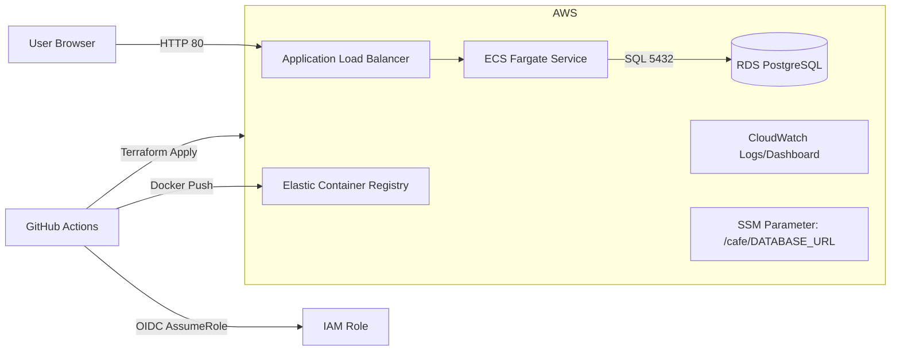

# Cafe App — AWS ECS Fargate Architecture (us-east-1)

**Notes**
- ECS tasks run in **public subnets** (assign public IP), ALB also in public subnets; RDS in **private subnets**.
- Security groups: ALB → ECS (port 5000), ECS → RDS (5432).
- The app reads `DATABASE_URL` injected from **SSM SecureString**.
- Logs to **CloudWatch**; you can add a dashboard + alarms.
- CI/CD uses **GitHub OIDC** to assume an AWS role (no static secrets).
